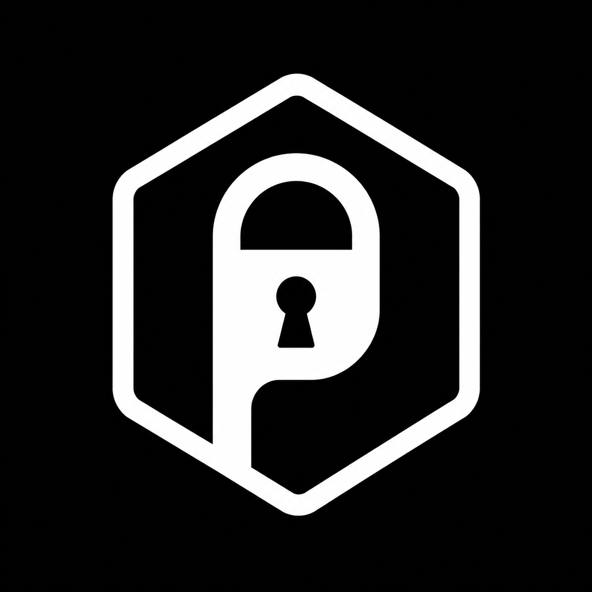

<div align="center">
  

  <h3>Passly</h3>
  <p>A local-first, open-source password manager for macOS and Windows.</p>

  <p>
    <a href="https://github.com/metesahankurt/passly/releases/latest">
      
    </a>
    
    
    <a href="LICENSE">
      
    </a>
  </p>
</div>

---

Passly stores your passwords **entirely on your device** — no cloud sync, no accounts, no telemetry. Your vault is encrypted with AES-256-GCM and a master password only you know.

## Features

- 🔒 **Zero-Knowledge Security**: AES-256-GCM encryption with PBKDF2 key derivation. Your master password never leaves your device and cannot be recovered.
- 💻 **Cross-Platform Native Experience**: Built with Tauri 2 and Next.js, featuring a custom frameless window title bar with native window controls.
- 🎨 **40+ Vibrant Themes**: Clean, modern UI designed with Tailwind CSS v4 and shadcn/ui. Switch between Light, Dark, or System mode, and choose from 40+ curated HSL themes.
- 📊 **Password Health Audit**: Instantly scan your vault for vulnerabilities. Get an overall security score (0-100) based on weak passwords (calculated via entropy bits), duplicated passwords, and passwords older than 90 days.
- 💳 **Secure Credit/Debit Card Storage**: Store credit and debit cards securely. Includes automatic card issuer detection (Visa, Mastercard, AMEX, Discover, etc.), expiry validation, and Luhn checksum validation.
- 🔍 **Have I Been Pwned (HIBP) Check**: Check if your passwords have been leaked in data breaches using secure k-Anonymity (SHA-1 hashing) via the HIBP API without exposing your passwords.
- 🔄 **Backup & Recovery**: Export your vault into a highly secure, encrypted `.psv` file, or import it back to restore your keys.
- 📥 **Browser & Manager CSV Import**: Import CSV database files directly from Chrome, Firefox, Safari, Edge, Bitwarden, LastPass, and 1Password.
- 🕒 **Auto-Lock Security**: Protect your session with configurable inactivity timers (1m, 5m, 15m, 30m, 1h, or never) that automatically lock your vault.
- 📜 **Password History**: Keeps a secure history of up to 10 previous passwords for each entry to prevent losing access to accounts.
- ⚡ **Command Palette & Hotkeys**: Press `Cmd+K` or `Ctrl+K` to search, preview, and copy passwords instantly. Access a hotkey guide to view all system shortcuts.
- 🏷️ **Categories & Tagging**: Organize your vault with custom categories and tag labels, with live filter comboboxes.
- 🔔 **Activity Log**: Stay informed with a built-in notification center logging all vault events (locking, unlocking, exports, imports, edits, and deletions).
- 🌐 **10 Locales Supported**: Native translation for English, Turkish, German, Spanish, French, Italian, Japanese, Portuguese, Russian, and Chinese.
- 🔌 **Fully Offline**: No internet access or accounts required to operate, running entirely client-side.

## Download

Go to the [latest release](https://github.com/metesahankurt/passly/releases/latest) and download the file for your platform:

| Platform | File |
|----------|------|
| macOS Apple Silicon (M1/M2/M3) | `Passly_*_aarch64.dmg` |
| macOS Intel | `Passly_*_x64.dmg` |
| Windows | `Passly_*_x64-setup.exe` |

> On first launch you will be asked to create a master password. This password cannot be recovered — store it somewhere safe.

## Development

### Prerequisites

- [Node.js](https://nodejs.org/) v20+
- [pnpm](https://pnpm.io/installation) v10+ (via Corepack: `corepack enable`)
- [Rust](https://www.rust-lang.org/tools/install) stable
- Xcode (macOS builds) or [Visual Studio C++ Build Tools](https://visualstudio.microsoft.com/visual-cpp-build-tools/) (Windows builds)

See Tauri's [prerequisites guide](https://v2.tauri.app/start/prerequisites/) for platform-specific setup.

### Getting started

```bash
pnpm install
pnpm dev
```

This starts the Next.js dev server (for web) and the Tauri desktop app in parallel.

### Commands

Run these commands from the repository root:

```bash
pnpm dev                  # Start web and desktop app in dev mode
pnpm web dev              # Start web app only (http://localhost:3000)
pnpm tauri dev            # Start desktop app only
pnpm tauri android dev    # Run Android app in dev mode
pnpm tauri ios dev        # Run iOS app in dev mode
pnpm build                # Build production bundle across all workspaces
pnpm typecheck            # Run TypeScript typechecks across all workspaces
pnpm check                # Run Biome/Ultracite lint and formatting checks
pnpm fix                  # Auto-format and fix lint issues
pnpm clean                # Remove build artifacts and temporary files
pnpm shadcn add <name>    # Add a shadcn/ui component to packages/ui
```

### Project structure

```
apps/
  web/              Next.js (SSR), landing page, docs site (Fumadocs), PWA (Serwist)
  native/           Next.js (static export) + Tauri 2 — desktop and mobile app

packages/
  core/             Shared business logic: pages, stores, hooks, components
  ui/               Design system: shadcn/ui primitives, 40+ themes, global styles (Tailwind v4)
  i18n/             Type-safe translations for all 10 locales
  typescript-config/ Shared TypeScript configs
```

## Tech stack

- **Core**: [Tauri 2](https://tauri.app/) (native OS wrapper & desktop shell) & [Next.js](https://nextjs.org/) (UI framework)
- **Styling**: [Tailwind CSS v4](https://tailwindcss.com/) with [@tailwindcss/postcss](https://www.npmjs.com/package/@tailwindcss/postcss) & [shadcn/ui](https://ui.shadcn.com/) (Radix UI primitives)
- **State Management**: [Zustand](https://zustand-demo.pmnd.rs/) with localStorage persistence
- **i18n**: [next-intl](https://next-intl-docs.vercel.app/) (type-safe localized routing and page rendering)
- **Security**: [Web Crypto API](https://developer.mozilla.org/en-US/docs/Web/API/Web_Crypto_API) (AES-256-GCM + PBKDF2 encryption)
- **Linting & Formatting**: [Ultracite](https://github.com/biomejs/biome) (Zero-config preset over Biome)

## License

[MIT](LICENSE)
